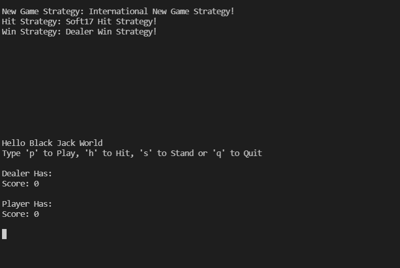

# A3_2_3

Assignment 3, grade 2 and 3.

## Welcome to Black Jack Game

- This is an implementation of a simple Black Jack game for grade 3 which uses GoF pattern like Visitor Pattern, Abstract Factory Pattern and Obsever Pattern to increase the cohesion and to achieve the low coupling among classes. This apps follos MVC pattern to separate view, controller and model packages.

- There have 8 different styles to play this Black Jack like BasicAmericanRuleWithDealerWinStrategy, BasicAmericanRuleWithPlayerWinStrategy, BasicInternationalRuleWithDealerWinStrategy, BasicInternationalRuleWithPlayerWinStrategy, SoftSevenTeenAmericanRuleWithDealerWinStrategy, SoftSevenTeenAmericanRuleWithPlayerWinStrategy, SoftSevenTeenInternationalRuleWithDealerWinStrategy,SoftSevenTeenInternationalRuleWithPlayerWinStrategy and the user can change these rules in controller.App class with model.rules.Game.

- Whenever the game start the NewGameStrategy, HitStrateGy and WinStrategy will be presented together with the beginning score of Dealer and Player.

