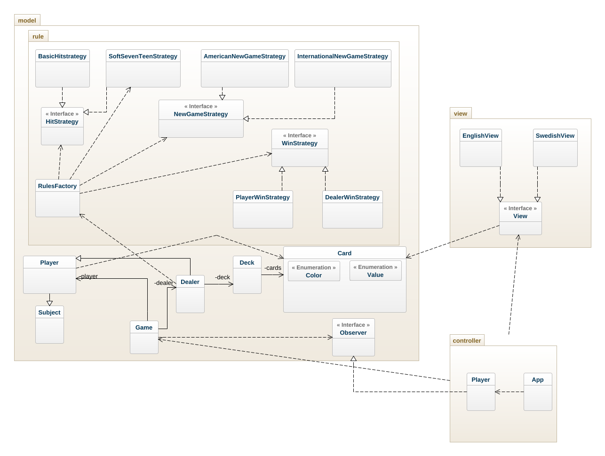
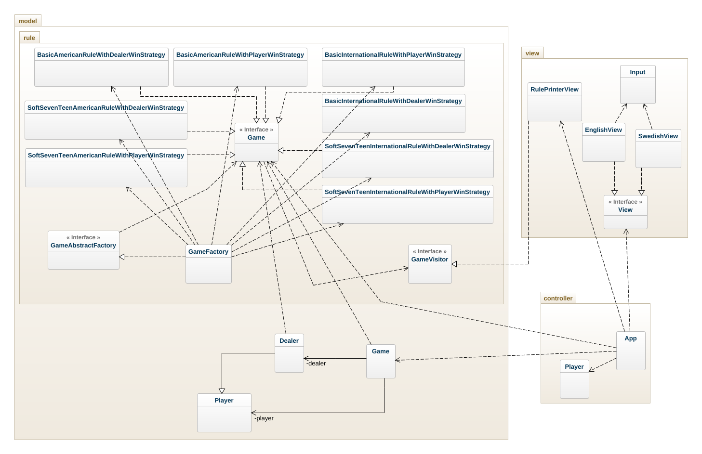

# BlackJack OO-Design
This document shows the design for grade_3.
## Class Diagram

- The class diagram after modification for soft17 and winStrategy together with Observer pattern.

- The class diagram after Abstract Factory and Visitor design pattern

## Dependencies
- There have many classes in the whole system diagram so the above class diagram only show important relations of new classes among model-view and controller. 

- The model.rules.Game class has dependency relation with NewGameStrategy, HitStrategy and WinStrategy classes that are not shown in the class diagram for simplicity.

- **BasicAmericanRuleWithDealerWinStrategy** class has dependency relation with AmericanNewGameStrategy, BasicHitStrategy and DealerWinStrategy classes.

- **BasicAmericanRuleWithPlayerWinStrategy** class has dependency relation with AmericanNewGameStrategy, BasicHitStrategy and PlayerWinStrategy classes.

- **BasicInternationalRuleWithDealerWinStrategy** class has dependency relation with InternationalNewGameStrategy, BasicHitStrategy and DealerWinStrategy classes.

- **BasicInternationalRuleWithPlayerWinStrategy** class has dependency relation with InternationalNewGameStrategy, BasicHitStrategy and PlayerWinStrategy classes.

- **SoftSevenTeenAmericanRuleWithDealerWinStrategy** class has dependency relation with AmericanNewGameStrategy, SoftSevenTeenHitStrategy and DealerWinStrategy classes.

- **SoftSevenTeenAmericanRuleWithPlayerWinStrategy** class has dependency relation with AmericanNewGameStrategy, SoftSevenTeenHitStrategy and PlayerWinStrategy classes.

- **SoftSevenTeenInternationalRuleWithDealerWinStrategy** class has dependency relation with InternationalNewGameStrategy, SoftSevenTeenHitStrategy and DealerWinStrategy classes.

- **SoftSevenTeenInternationalRuleWithPlayerWinStrategy** class has dependency relation with InternationalNewGameStrategy, SoftSevenTeenHitStrategy and PlayerWinStrategy classes.